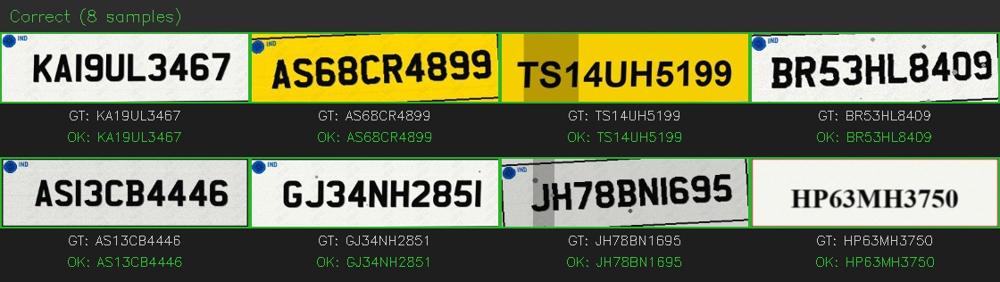

# Optical_Character_Recognition_Model
OCR to Read Characters in ANPR (Automated License Plate Recognition) for Indian Dataset. 

## Indian License Plate OCR

Lightweight OCR model trained to read text from cropped Indian license plate images.
Designed to run **after** a plate detection model takes cropped plate crops as input, outputs plate text.


Demo:


---

## Project Structure

```
ModelOCR/
├── config/
│   ├── model_config.yaml         # CCT model architecture
│   └── plate_config.yaml         # alphabet, image size, max slots
├── dataset/
│   ├── generate_indian_plates.py # to create plates
│   ├── plates/
│   │   ├── images/               # 5000 synthetic plate JPGs
│   │   └── annotations.csv       # filename + plate_text labels
│   ├── train.csv                 # generated at train time (4250 plates)
│   └── val.csv                   # generated at train time (750 plates)
├── model/
│   ├── output/
│   │   └──<timestamp>_.../
│   │       ├── best.keras        # for retraining / fine-tuning
│   │       └── best.onnx         # for inference (portable)
│   ├── train.py                  # split + validate + train
│   ├── export.py                 # keras → onnx
│   └── evaluate.py               # accuracy + inference
├── README.md
└── requirements.txt
```

---

## Setup

### Inference only (deployment)
```bash
pip install fast-plate-ocr==1.1.0 opencv-python-headless numpy
```

### Training (to retrain or fine-tune)
```bash
pip install "fast-plate-ocr[train]==1.1.0"
pip install torch torchvision
```

---

## Quick Start

### Run inference on a plate image
```python
from fast_plate_ocr import LicensePlateRecognizer
import cv2

model = LicensePlateRecognizer(
    "model/output/<timestamp>/best.onnx",
    config="config/plate_config.yaml"
)

img = cv2.imread("path/to/cropped_plate.jpg")
result = model.run([img])
print(result)  # ['MH04AB1234']
```

### Evaluate accuracy on val set
```bash
python model/evaluate.py --mode eval
```

### Run inference on a folder of plate images
```bash
python model/evaluate.py --mode infer --input path/to/folder/

# Save results to CSV
python model/evaluate.py --mode infer --input path/to/folder/ --save results.csv
```

---

## Training

### Step 1 — Generate synthetic dataset
```bash
cd dataset
python generate_indian_plates.py --num 5000 --out plates
```

Generates 5000 cropped plate images:
- 85% Indian (75% HSRP + 25% old-style)
- 15% Foreign (EU, US, UK, Gulf)

With augmentations: noise, blur, rotation, perspective warp, shadows, dirt.

### Step 2 — Train
```bash
python model/train.py
```

Edit parameters at top of `train.py`:
| Parameter | Default | Notes |
|---|---|---|
| `EPOCHS` | 100 | Increase if accuracy still improving |
| `BATCH_SIZE` | 16 | Reduce if GPU OOM |
| `LEARNING_RATE` | 0.001 | Reduce to 5e-4 if loss spikes |
| `EARLY_STOP_PATIENCE` | 15 | Epochs without improvement before stopping |
| `KERAS_BACKEND` | torch | Change to `tensorflow` if no PyTorch |

Output saved to `model/output/<timestamp>/best.keras`

### Step 3 — Export to ONNX
```bash
python model/export.py
```

Update `KERAS_MODEL` path in `export.py` to match your training timestamp.
Output: `best.onnx` in same folder as `best.keras`.

---

## Model

**Architecture:** CCT (Compact Convolutional Transformer)
- CNN tokenizer → extracts visual features
- Transformer encoder → reads character context
- Output → 10 character slots × 37 classes (0-9, A-Z, pad)

**Input:** 140×70 grayscale image (cropped plate)
**Output:** plate text string e.g. `MH04AB1234`

**Training results (epoch 69, early stopped):**
- `val_len_acc: 1.0000`
- `val_loss: 0.0965`
- `val_top3_acc: 0.9997`

---

## Plate Coverage

| Type | Share | Details |
|---|---|---|
| India HSRP | 63% | Charles Wright font, reflective bg, hologram, INDIA watermark |
| India old | 21% | Pre-2019, varied fonts, no hologram |
| Foreign | 15% | EU, US, UK, Gulf styles |

---

## Portability

To use `best.onnx` on another machine:

1. Copy `best.onnx` + `config/plate_config.yaml`
2. Install: `pip install fast-plate-ocr`
3. Run inference as shown above

No GPU, PyTorch, TensorFlow, or Keras needed for inference.

---

## To Improve Accuracy

1. Add real Indian plate crops to `dataset/plates/images/` with correct labels in `annotations.csv`
2. Increase dataset size: `python generate_indian_plates.py --num 10000`
3. Switch `model_config.yaml` activation from `gelu` to `silu` (also avoids ONNX export patching)
4. Increase transformer layers in `model_config.yaml`
5. Retrain: `python model/train.py`
